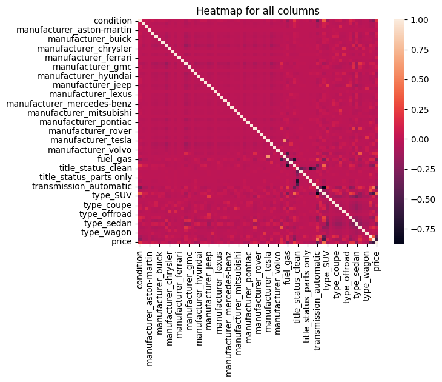

# What drives the price of a car?

**OVERVIEW**

In this application, you will explore a dataset from Kaggle. The original dataset contained information on 3 million used cars. The provided dataset contains information on 426K cars to ensure speed of processing.  Your goal is to understand what factors make a car more or less expensive.  As a result of your analysis, you should provide clear recommendations to your client -- a used car dealership -- as to what consumers value in a used car.

### CRISP-DM Framework

    

To frame the task, throughout our practical applications, we will refer back to a standard process in the industry for data projects called CRISP-DM.  This process provides a framework for working through a data problem.  Your first step in this application will be to read through a brief overview of CRISP-DM [here](https://mo-pcco.s3.us-east-1.amazonaws.com/BH-PCMLAI/module_11/readings_starter.zip).  After reading the overview, answer the questions below.

### Business Understanding

From a business perspective, we are tasked with identifying key drivers for used car prices.  In the CRISP-DM overview, we are asked to convert this business framing to a data problem definition.  Using a few sentences, reframe the task as a data task with the appropriate technical vocabulary.

### Objective
Develop a machine learning model that can accurately predict the selling price of used cars based on various features. Our model should take into account all of the given attributes (year, manufacturer, model, fuel type, etc.)

### Success Criteria
For a given row in the input dataset, our model will be able to analyze the attributes given and predict the price of the car with acceptable accuracy.

### Data Understanding

After considering the business understanding, we want to get familiar with our data.  Write down some steps that you would take to get to know the dataset and identify any quality issues within.  Take time to get to know the dataset and explore what information it contains and how this could be used to inform your business understanding.

### Evaluation

With some modelling accomplished, we aim to reflect on what we identify as a high-quality model and what we are able to learn from this.  We should review our business objective and explore how well we can provide meaningful insight into drivers of used car prices.  Your goal now is to distil your findings and determine whether the earlier phases need revisitation and adjustment or if you have information of value to bring back to your client.

From our heatmap we can see that age, mileage, type, and condition of the vehicle all had the highest impact on price. One surprising thing that we noticed was that title status didn't have as large of an impact on price as one would assume. One possible reason for this could be the large amount of missing data that we had. Perhaps a more complete dataset would yield completely different results.

From this, we can see that our lasso regression model preformed the best and our linear regression model preformed the worst. Likely the problems with our linear regression model were due to overfitting. As such when we used L1 regularisation, we were able to reduce the number of errors leading to a drastic increase in accuracy and a decrease in RMSE and MAE.*italicised text*

### Deployment

Now that we've settled on our models and findings, it is time to deliver the information to the client.  You should organize your work as a basic report that details your primary findings.  Keep in mind that your audience is a group of used car dealers interested in fine-tuning their inventory.

Using this data dealerships could optimise their fleets in order to maximise profits. This analysis could be redone with a focus on the region that the dealership is from, looking to discover prospective buyers' tastes. Being able to optimise the dealership's acquisitions will help significantly in raising profits. Dealerships would know that purchasing a newer car would be significantly more beneficial than a classic. As well, focusing on keeping your fleet low mileage would also work to increase the price people are willing to pay.

